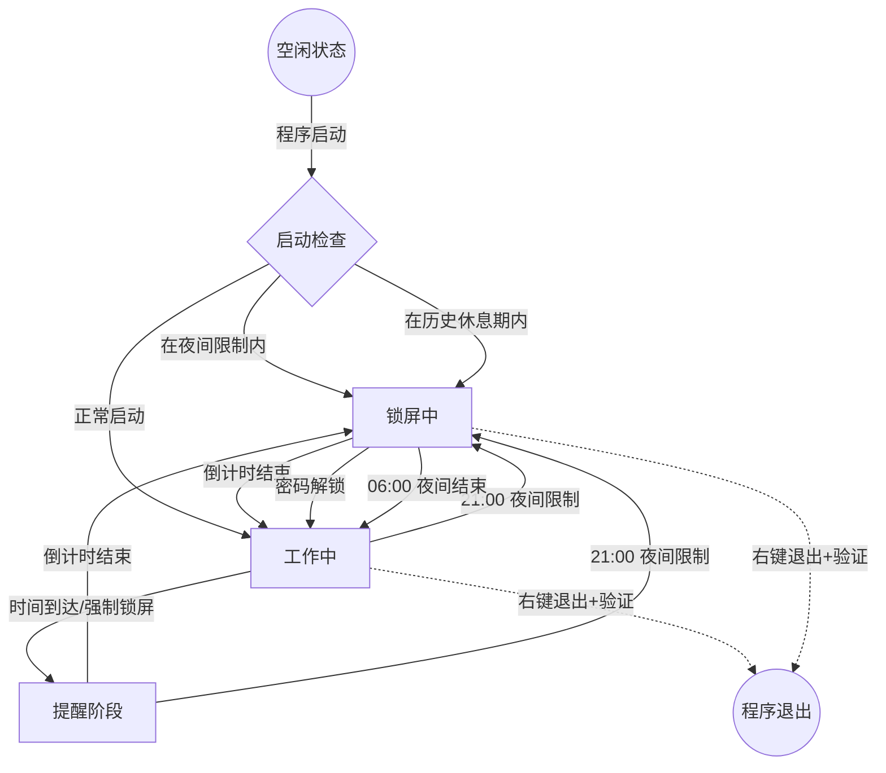

任何情况以中文回复

每次创建任务, 需要采用 superpowers:brainstorming 模式, 以便更好地发挥创造力和解决问题的能力。
并且把任务做的方式输出到docs/plans中做好记录, 便于后续维护

# 运行环境

```bash
uv run *
```

# 项目架构

## 业务流程图 (Mermaid)



## 目录结构

- `main.py` - 程序入口
- `config.py` - 配置管理
- `config.json` - 运行时配置
- `core/` - 核心业务逻辑
- `ui/` - UI 组件
- `utils/` - 工具函数
- `platform/` - 平台相关代码（Windows）
- `docs/plans/` - 设计和实现文档

## 关键模块

- `core/controller.py` - 主控制器
- `core/lock_manager.py` - 锁屏管理
- `core/state_machine.py` - 状态机
- `utils/night_restrict.py` - 夜间限制时段判断
- `ui/` - tkinter 界面

# 开发命令

```bash
uv run python main.py           # 开发模式运行
uv run python main.py --install # 安装到开机启动
./build.sh                      # 构建可执行文件
```

# 构建产物

- `dist/ParentControl.windows.{版本号}.exe` - 构建后的可执行文件（如 `ParentControl.windows.1.7.9.exe`）
- `build/` - 构建临时文件

## 夜间限制配置 (config.json)

- `restrict_night_hours.enabled` - 是否启用夜间限制
- `restrict_night_hours.start_hour` - 开始时间（默认21）
- `restrict_night_hours.end_hour` - 结束时间（默认6）

## 版本号

- 从 `pyproject.toml` 读取，使用 `tomllib` 模块
- `config.get_version()` 函数获取

# 注意事项

- 程序使用单实例锁，同一时间只能运行一个实例
- 支持系统托盘运行和锁屏功能
- 配置文件 `config.json` 在运行时加载
