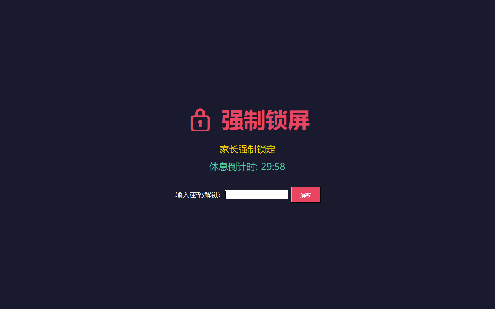
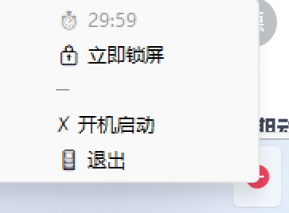

# 家长控制程序-windows版本

#### 介绍
家长控制程序,windows电脑版, 就最简单的方式 每隔30分钟休息30分钟, 或输入密码解锁. python + tk 跨平台

#### 功能
计时锁屏 -> 进入休息时间
休息时间倒计时结束后 -> 解锁屏幕 -> 开始新的一轮计时锁屏

锁屏后，可输入密码解锁，重新计时
可配置计时锁屏时间；休息时间；解锁密码

#### 提前提醒功能
到达锁屏时间前，会发送系统通知和播放音效提醒用户保存工作：
- **系统通知**：弹窗显示"距离锁屏还剩 X 分钟，请保存工作！"，5秒后自动消失
- **声音提醒**：播放 Windows 系统音效（Ring04.wav），全屏游戏时也能听到
- 可配置提前提醒时间（默认5分钟）



右下角图标


#### 开发测试启动命令
uv run main.py

#### 打包成 exe
Windows (PowerShell):
```powershell
.\build.ps1
```

Linux/Mac (Bash):
```bash
bash build.sh
```

打包后的文件位于 `dist/ParentControl.exe`

#### 日志系统
程序使用统一的日志系统，所有日志会同时输出到：
- 控制台（实时查看）
- 日志文件：`log/年-月-日.log`（例如：`log/2026-02-24.log`）

日志格式：`[时间戳] [级别] [模块] 消息`

详细说明请查看：[日志系统文档](doc/logging.md)

#### 配置 config.json

``` json
{
    "password": "0829", //密码
    "work_minutes": 30, //工作/学习计时时长(分钟)，到达时间后自动锁屏
    "break_minutes": 30, //休息倒计时时长(分钟)，休息期间无法解锁
    "remind_before_minutes": 5, //提前提醒时间(分钟)，锁屏前多久发送通知和声音提醒
    "auto_restart_after_lock": true //锁屏后是否自动重启计算机
}
```


